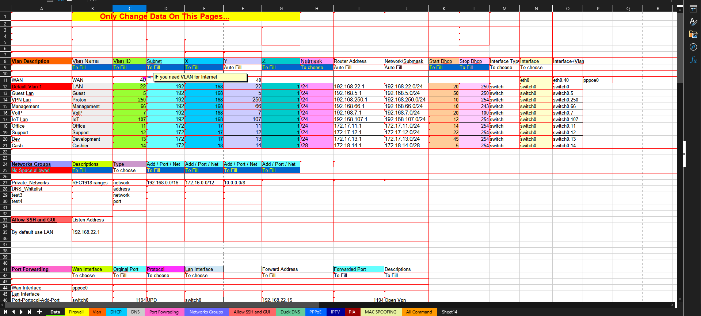

# Edge_Router

---
 

## Edge Router auto Config file

---
 

## 🖼️ Screenshots

  

---
 

## 📖 About
This is a Excel File to create all the commmand to setup your Egde Router juste Fill 
the first pages he will spit out all the command to setup your router through command line 

---
 

## License
[Unlicense](LICENSE)

---
